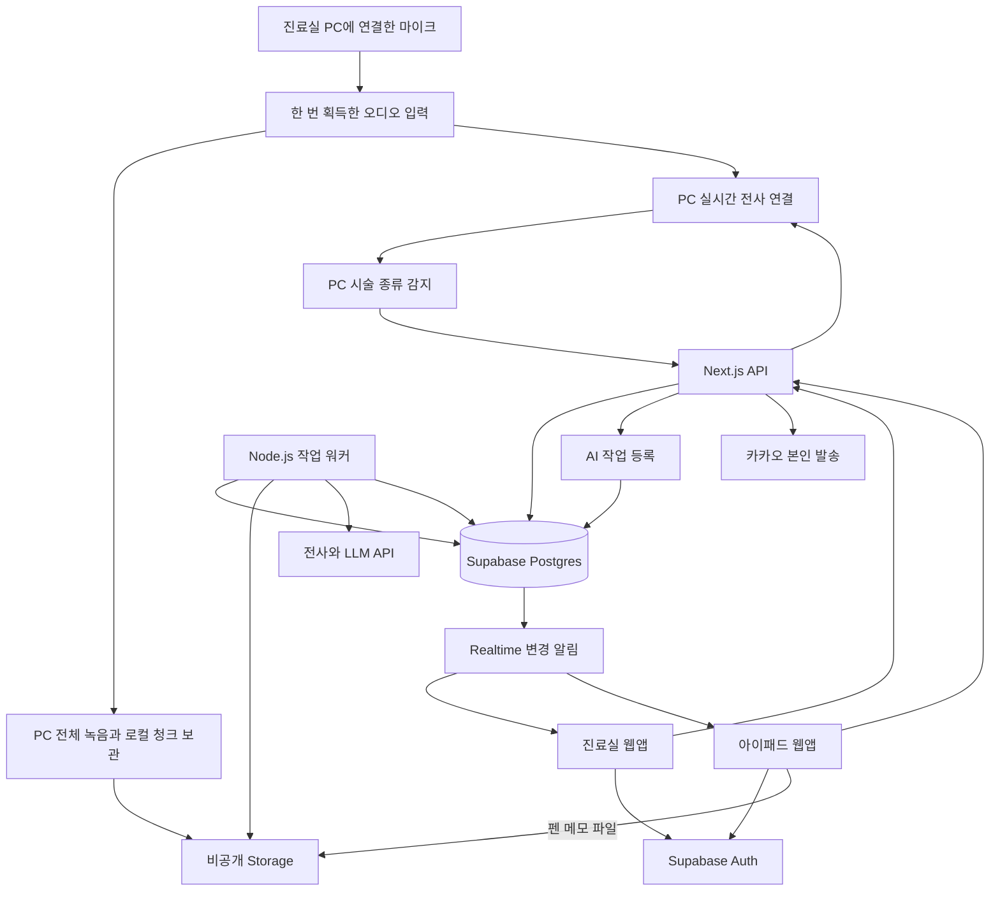

# HaniSOAP 전체 구현 계획

작성일: 2026년 10월 9일 KST

상태: 상세 구현 계획 초안. PC·아이패드 웹앱, Next.js·TypeScript, Supabase는 이번 대화에서 확정했다. 아래의 세부 스키마, API, 모델 후보, 작업 방식은 구현을 위한 제안이다.

녹음 방식 추가 결정: 진료실 PC에서 선택한 마이크를 한 번 열고, 같은 입력으로 전체 녹음 저장과 실시간 전사를 함께 시작한다. 아이패드는 별도 수음 없이 상태·감지 결과를 받아 시술을 확인한다.

음성 입력 추가 결정: PC 실시간 녹음과 별도로 음성 파일 업로드를 제공한다. 기존 파일만으로 전사·사전 보정·SOAP 생성 데모를 실행할 수 있어야 한다.

용어 보정 추가 결정: 교정 후보에 한글 명칭, 한자, 원래 표기와 출처를 함께 제공한다. 같은 이름에 여러 원자료가 있으면 출처별 기록을 보존하고 의료진이 근거를 확인할 수 있게 한다.

진료 녹음과 치료실 기록을 한 방문에 모으고, 한의사가 검토한 기록을 환자 안내와 다음 재진으로 연결한다. 기존 기획서의 P0, P1, P2 순서를 따른다. P0의 핵심 순환을 실제 데이터로 완성한 뒤 아이패드와 실시간 기능을 붙인다.

## 1 확정 사항과 구현 기본안

| 항목 | 결정 또는 기본안 |
| --- | --- |
| 사용 기기 | 진료실 PC와 아이패드 모두 브라우저 웹앱 |
| 애플리케이션 | 하나의 Next.js 프로젝트, TypeScript, App Router와 Route Handlers |
| 데이터 | Supabase Postgres, Storage, Realtime |
| 음성 입력 | 진료실 PC에서 외장 또는 선택한 마이크로 한 번 수음. 아이패드에서 별도로 녹음하지 않음 |
| 파일 입력 | 진료실 화면에서 별도 음성 파일 업로드 지원. 마이크 없이 일반 데모 실행 |
| 음성 처리 | 녹음 시작 한 번으로 같은 입력의 전체 녹음 저장과 실시간 전사를 함께 실행. 종료 후 저장 파일을 정밀 전사 |
| 용어 처리 | 연화가 제공한 변증명·처방명 사전에서 후보 검색 후 LLM에 문맥과 후보 전달 |
| 임상 기록 | 근거가 연결된 초안을 만들고 한의사가 검토·수정·확정 |
| 환자 접점 | 카카오톡 중심. 별도 환자 계정·문진·통증 입력 앱은 만들지 않음 |
| P0 메시지 | 알림톡 형식 미리보기와 모의 응답으로 전체 순환 완성 |
| P1 메시지 | 카카오 나에게 보내기로 발표자 본인에게 발송하는 데모 |
| EMR | P2에서 복사와 시그마차트 모의 전송 |
| 실행 환경 | 선택 대기. 기본안은 맥북의 Node.js 앱과 워커, 아이패드는 HTTPS 주소로 접속 |
| 외부 서버 조건 | 사용자가 현장에 별도 제한이 없었다고 확인 |
| 발표 산출물 | 예선 4분·본선 10분 PDF를 추후 별도 제작. 이 계획에서는 개발만 다룸 |

하나의 진료실과 사전에 등록한 의료진 계정으로 시작한다. 기관 구분 필드는 처음부터 두되 기관 가입, 요금제, 복잡한 관리자 기능은 후속 범위로 둔다.

## 2 범위와 완료 기준

| 우선순위 | 구현 범위 | 완료 기준 |
| --- | --- | --- |
| P0 | 환자·방문·이력, PC 전체 녹음·파일 업로드·전사·용어 보정, SOAP 검토, 확인 항목, 재진 브리핑·VAS, 안내 승인·미리보기, 모의 응답·연락 필요 | 한 환자의 진료부터 다음 재진까지 DB에 저장된 정보로 연결되고 새로고침 후에도 유지 |
| P1 | 아이패드 부위·혈자리·좌우·펜 기록, PC 동기화, 실제 기기 검증, 실시간 시술 감지, 카카오 본인 발송 | 아이패드에서 확인한 오늘 시술이 같은 방문의 PC 화면에 반영되고 카카오 응답 데모가 연결 |
| P2 | EMR 복사·모의 전송, 손글씨 AI 정리 | 확정 기록을 복사하거나 모의 전송하고, 원본 손글씨와 인식 후보를 대조 |

P0는 안내 미리보기에서 멈추지 않는다. 응답을 저장하고 다음 브리핑과 연락 목록이 바뀌는 것까지 포함한다. P1을 시작하기 전에 P0의 첫 전체 동작을 검증한다.

모의 응답·시간 이동·사전 저장 결과 재생은 화면에서 해당 모드를 표시한다. 실제 API 처리와 같은 성공 상태로 섞지 않는다. 실시간 음성 연결이 실패해도 수동 시술 선택과 종료 후 파일 전사는 계속 쓸 수 있게 한다.

## 3 시스템 구조



화면은 기록을 보여주고 입력을 받는다. API는 로그인·소속·방문 연결을 검증하고 변경을 저장한다. 워커는 오래 걸리는 전사와 LLM 작업을 수행한다. Realtime은 변경을 알리고, 각 화면은 권한이 있는 최신 데이터를 다시 읽는다.

마이크 입력과 실시간 전사 연결의 소유자는 진료실 PC다. PC에서 감지한 시술 이벤트가 API·DB·Realtime을 거쳐 아이패드로 전달된다. 아이패드는 마이크 권한이나 별도 오디오 전송 없이 혈자리·좌우·펜 기록을 입력한다.

### 3.1 코드와 라이브러리 기본안

- Next.js와 React, TypeScript를 사용한다. 버전은 착수 시 호환 조합을 확인해 고정하고 lockfile을 커밋한다.
- Supabase 공식 클라이언트와 Next.js SSR 인증 도구를 사용한다.
- 화면과 API가 공유하는 데이터 형식은 Zod 등 하나의 스키마 정의로 검증한다.
- OpenAI 공식 JavaScript SDK를 서버·워커에서 호출한다. 모델 호출부를 기능별 모듈로 감싸 교체 범위를 제한한다.
- 스타일은 CSS 변수와 Tailwind 계열 유틸리티로 구성한다. 색·간격·타이포그래피를 토큰으로 관리한다.
- 첫 화면 데이터는 서버에서 읽고, 편집·진행 상태·기기 동기화가 필요한 부분만 클라이언트 상태로 관리한다.
- 서버 데이터와 미저장 편집값을 구분한다. 화면마다 전역 환자 상태를 복사해 별도 진실로 만들지 않는다.

### 3.2 앱 실행 방식

기본안은 맥북에서 Next.js Node.js 서버와 작업 워커를 함께 실행하고, 아이패드는 HTTPS 터널 주소로 접속하는 것이다. Supabase와 AI API는 외부 서비스를 사용한다. Next.js는 Node.js 서버로 실행할 수 있다. [Next.js Self Hosting](https://nextjs.org/docs/app/guides/self-hosting)

브라우저 마이크 접근에는 HTTPS 또는 localhost 같은 보안 컨텍스트가 필요하다. 마이크 권한과 외장 마이크 입력은 PC에서 확인한다. 아이패드는 HTTPS 주소로 접속·로그인·동기화를 확인하며 마이크 권한을 요청하지 않는다. [MDN getUserMedia](https://developer.mozilla.org/en-US/docs/Web/API/MediaDevices/getUserMedia)

Vercel을 선택하면 웹앱과 API를 배포하고 워커 실행 위치도 함께 정한다. 로컬 워커를 유지할 수도 있고 별도의 내구성 있는 작업 실행 수단으로 옮길 수도 있다. API 응답 뒤 임의의 비동기 함수를 계속 돌리는 것을 작업 보장으로 삼지 않는다. 호스팅 변경은 데이터·AI 기능 모듈을 바꾸지 않고 실행부에서 처리한다.

## 4 화면과 사용자 흐름

### 4.1 진료실 웹앱

| 경로 제안 | 화면 | 필요한 내용과 동작 |
| --- | --- | --- |
| `/clinic` | 오늘 현황 | 환자 목록, 진료 상태, 오늘 연락 필요, 진행 중 작업 |
| `/clinic/patients/[patientId]` | 환자 이력 | 방문 날짜, VAS 표·그래프, 이전 확정 SOAP, 안내·응답 이력, 오늘 진료 시작 |
| `/clinic/visits/[visitId]` | 오늘 진료 | 브리핑, 마이크 선택·녹음 시작/종료·파일 업로드, 전사 검토, SOAP, 확인 항목, 안내 |
| `/clinic/care` | 후속 관리 | 안내 일정, 응답, 연락 필요, 담당자의 연락 완료 처리 |
| `/settings` | 최소 설정 | 기기 연결, 모델 연결 상태, 카카오 연결, 데모 데이터 관리 |

오늘 진료 화면은 환자 이름·식별자·방문일을 고정 표시한다. 본문에는 재진 준비, 전사·SOAP 검토, 진료 후 안내의 작업 탭을 둔다. 전사 검토 시 원문과 교정 후보를, SOAP 검토 시 근거와 초안을 나란히 보여준다.

모든 편집 화면은 저장됨, 저장 중, 미저장, 실패 상태를 표시한다. 환자를 바꿔도 진행 중 작업의 소유 방문은 바뀌지 않는다. 늦게 도착한 다른 방문의 결과를 현재 화면에 덮어쓰지 않는다.

녹음 시작 버튼 하나로 전체 녹음과 실시간 처리를 시작한다. 선택 마이크, 입력 레벨, 녹음 경과 시간, 전체 녹음 상태, 실시간 연결 상태를 따로 표시한다. 실시간 연결 준비 중이거나 재연결 중일 때도 전체 녹음이 저장되는지 구분할 수 있게 한다. 녹음 제어는 진료실 공통 레이아웃에서 유지해 화면 탭 전환으로 오디오 세션이 해제되지 않게 한다.

음성 입력 영역에는 `실시간 녹음 시작`과 `음성 파일 업로드`를 별도 행동으로 제공한다. 파일 선택 또는 드래그앤드롭으로 업로드할 수 있고 파일명·크기·업로드 상태를 표시한다. 업로드 방식은 마이크 권한이나 실시간 세션 연결을 요구하지 않는다. 두 방식 모두 현재 방문에 명시적으로 연결한다.

### 4.2 아이패드 웹앱

경로는 `/tablet/visits/[visitId]`로 둔다. 로그인 후 PC에서 선택한 방문의 QR 또는 연결 코드를 사용한다. 코드에는 방문 연결 정보만 넣고 권한을 대신하지 않는다. 다른 계정은 같은 진료실 소속인지 검증한다.

화면에는 환자·방문 고정 헤더, PC 녹음·실시간 연결 상태, 감지한 시술 종류, 앞·뒤 인체, 부위 확대, 큰 한글 혈자리 목록, 좌우 선택, 메모, 저장 상태를 둔다. 녹음 시작 버튼과 마이크 권한 요청은 두지 않는다. PC가 다른 환자를 선택하더라도 아이패드의 방문을 자동 전환하지 않는다. 새 방문 연결을 명시적으로 선택한다.

가로 화면은 인체와 목록을 나란히, 세로 화면은 인체 아래에 목록을 배치한다. 데모는 발목부터 완성하고 허리, 목·어깨, 무릎으로 확장한다.

### 4.3 화면 표현 원칙

- 임상 작업 공간에 맞춰 밝고 차분한 바탕, 읽기 쉬운 한글, 한 가지 중심 강조색을 사용한다.
- 목록·기록·근거를 읽기 쉽게 배치하고 장식용 카드와 통계 박스를 늘리지 않는다.
- AI 초안, 의료진 확인, 모의 처리의 상태를 명확히 표시한다.
- 근거 선택 시 원문 구간을 강조하고, 저장 완료·시술 선택에 짧은 피드백을 준다.
- 아이패드의 부위 확대는 연속성을 유지하되 사용자의 입력을 막지 않는다. 동작 감소 설정을 존중한다.
- 일반 입력과 선택은 키보드로도 조작할 수 있게 한다. 혈자리 선택 행과 주요 버튼은 44×44 CSS px 이상의 터치 영역을 목표로 한다.

### 4.4 시그마차트 원본 화면을 반영한 UI 초안

의료진에게 익숙한 시그마차트의 기록 순서와 정보 배치를 참고한다. [원본 화면 관찰 문서](reference/sigmachart/README.md)에 공식 공개 PNG 4장과 출처, 관찰 내용, HaniSOAP 확장 제안을 정리했다. 연화가 별도로 참고한 원본 5장과의 동일성은 미확인이다.

진료실의 기본 배치는 왼쪽에 환자 정보·날짜별 과거 기록, 중앙에 오늘 SOAP와 시술 기록, 오른쪽에 재진 브리핑·확인할 것·근거를 두는 안으로 검토한다. 원본의 오른쪽 달력·알림을 HaniSOAP에서는 진료 지원 정보로 확장하는 제안이다. 상단에는 환자·방문과 PC 녹음·파일 업로드 상태를 고정한다.

시술 입력은 시술 종류, 세부 기법, 부위·혈자리, 좌우, 도구·약제·수량·시간을 구분한다. 정중선·좌우 해당 없음과 투자법의 시작·도달 혈자리도 표현할 수 있는 구조를 검토한다. 실제 초기 필수 항목은 [시술 차팅 목록](reference/한방_시술_차팅_목록.md)에서 연화와 선별한다.

오늘 현황과 환자 한 명의 진료 작업은 분리하고 같은 환자 선택·상태 표현을 유지한다. 아이패드에는 같은 명칭을 쓰되 부위 확대와 큰 목록을 적용한다. 이 배치안은 아직 와이어프레임·실제 화면 구현으로 확정하지 않은 초안이다.

## 5 데이터 설계

### 5.1 공통 규칙

- 사용자 데이터는 `clinic_id`를 가진다. 환자·방문·파일·생성 결과가 같은 기관에 속하는지 서버와 DB 제약으로 확인한다.
- 시간은 UTC `timestamptz`로 저장하고 날짜 표시와 예정일 계산은 `Asia/Seoul` 기준으로 한다.
- 원음, 최초 전사, 승인 기록은 덮어쓰지 않는다. 수정은 새 버전으로 저장한다.
- 생성 결과에는 입력 버전, 사전 버전, 프롬프트 버전, 모델 ID, 생성 시각을 남긴다.
- 현재 방문의 사실과 과거 방문의 사실을 출처와 날짜로 구분한다.
- 점수 미확인은 `null`로 둔다. 0점과 구분한다.

### 5.2 P0 테이블

| 테이블 | 핵심 필드 | 역할 |
| --- | --- | --- |
| `clinics` | id, name, timezone | 한의원 설정 |
| `clinic_members` | clinic_id, user_id, role | 계정과 기관 소속. 계정당 기관 소속을 서버가 확인 |
| `patients` | id, clinic_id, display_name, demographic_summary, chief_complaint, is_demo | 환자 기본 정보. 데모는 가명·가상 정보 사용 |
| `visits` | id, clinic_id, patient_id, visited_at, status, version, approved_soap_id | 방문의 중심 레코드 |
| `audio_sessions` | id, clinic_id, visit_id, owner_user_id, owner_device_id, capture_state, recording_state, realtime_state, started_at, ended_at, heartbeat_at | PC의 단일 수음 세션과 두 처리 경로의 상태 |
| `recordings` | id, clinic_id, visit_id, audio_session_id, source, object_path, mime, bytes, duration, checksum, status | PC 녹음·직접 파일 업로드와 처리 상태. 파일 업로드만 한 경우 audio_session_id는 null |
| `transcripts` | id, clinic_id, visit_id, recording_id, parent_id, revision, kind, text, model_id | 원문·보정·검토 전사 버전 |
| `transcript_segments` | id, transcript_id, ordinal, text, start_offset, end_offset, speaker, speaker_status, start_ms, end_ms | 근거 구간. 모델이 주지 않은 시간은 null |
| `correction_proposals` | id, transcript_id, segment_id, span, candidate_ids, selected_term_id, reason, status, reviewed_by | 사전 교정 제안과 의료진 선택 |
| `visit_documents` | id, clinic_id, visit_id, kind, revision, input_refs, input_hash, content, status, approved_by, approved_at | 분석·SOAP·브리핑의 버전별 JSON 문서 |
| `followup_items` | id, clinic_id, patient_id, source_visit_id, source_ref, item_key, title, status, selected_by, resolved_at | 다음 방문에 확인할 항목 |
| `observations` | id, clinic_id, patient_id, visit_id, type, value, unit, source_ref, status | 승인한 VAS와 필요한 측정치 |
| `care_messages` | id, clinic_id, patient_id, visit_id, stage, scheduled_at, revision, draft_body, approved_body, approved_hash, status, channel | 안내와 시점별 확인 메시지 |
| `care_responses` | id, clinic_id, message_id, option, detail, source, received_at, event_key | 모의·카카오 링크 응답 |
| `contact_tasks` | id, clinic_id, patient_id, response_id, reason, status, closed_by, closed_at | 오늘 연락 필요와 연락 완료 |
| `ai_jobs` | id, clinic_id, visit_id, kind, input_refs, input_hash, status, attempts, lease_until, output_ref, error_code | AI 단계별 작업과 복구 |

`visit_documents.kind`는 `analysis`, `soap`, `briefing`으로 구분한다. 독립 테이블을 과도하게 늘리지 않고 버전과 입력 참조를 공통 관리한다. 안내는 승인 문안·발송 상태가 중요하므로 별도 테이블로 둔다.

표에는 일부 반복 필드를 생략했다. 환자 데이터를 담는 모든 테이블에는 `clinic_id`, 생성·수정 시각, 필요한 작성자·검토자 필드를 적용한다. 구간·교정·응답 같은 자식 데이터도 부모의 기관과 일치하도록 검사한다.

### 5.3 P1과 P2에서 추가할 데이터

| 데이터 | 핵심 필드와 동작 |
| --- | --- |
| `treatment_entries` | visit_id, modality, body_region, acupoint_code, laterality, status, source, version. 오늘 확인한 시술만 confirmed |
| `annotation_documents` | visit_id, view, coordinate_version, SVG 기준 stroke 데이터, revision. 지우기·되돌리기도 버전 보존 |
| `device_links` | visit_id, 생성자, 만료 시각, 연결 상태. 활성 방문 선택을 돕는 용도 |
| `live_procedure_events` | visit_id, audio_session_id, session_id, item_id, text, modality, detected_at, status. 전체 녹음과 같은 수음 세션에 연결. 감지 후보와 실제 시행 구분 |
| `channel_connections` | clinic_id, provider, 서버 전용 암호화 토큰, 만료 시각. 브라우저 응답과 로그에 토큰 제외 |
| `message_deliveries` | message_id, approved_hash, request_key, status, provider_result, attempted_at. mock·kakao_self 분리 |
| `export_events` | visit_id, 승인 기록 버전, export_type, 시각. EMR 복사와 mock 전송 구분 |

### 5.4 제약과 인덱스

- 환자 참조와 방문 참조에 기관을 포함한 복합 FK 또는 동등한 DB 검증을 둔다. 부모와 다른 `clinic_id`의 자식 행을 거절한다.
- `visits(patient_id, visited_at)`, `recordings(visit_id)`, `transcripts(visit_id, revision)`, `visit_documents(visit_id, kind, revision)`을 인덱싱한다.
- `observations(patient_id, type, visit_id)`, `followup_items(patient_id, status)`, `contact_tasks(clinic_id, status)`을 인덱싱한다.
- VAS는 0~10 범위를 검사하고, 같은 방문·종류의 활성 승인값을 중복 생성하지 않는다.
- AI 작업은 동일한 종류·입력 해시의 활성 작업 중복을 막는다. 완료된 동일 입력은 결과를 재사용할 수 있다.
- 응답은 이벤트 키, 연락 작업은 최초 불편 응답 기준으로 중복 생성을 막는다.
- 시술 저장은 항목 ID와 버전으로 갱신하며 체크 해제·재선택으로 같은 기록을 중복 추가하지 않는다.
- Foreign Key에는 필요한 조회 인덱스를 별도로 둔다. [PostgreSQL Foreign Keys](https://www.postgresql.org/docs/current/ddl-constraints.html#DDL-CONSTRAINTS-FK)

### 5.5 인증과 저장소

Supabase Auth로 미리 등록한 팀원 계정을 사용한다. 공개 회원 가입 화면은 만들지 않는다. API는 서버에서 사용자 신원을 검증하고 `clinic_members`로 소속을 확인한다. 사용자 수정 가능 메타데이터를 권한 판단에 쓰지 않는다.

노출 스키마의 사용자 데이터 테이블에는 RLS를 적용한다. 단순히 로그인 여부만 검사하지 않고 기관 소속으로 행 접근을 제한한다. UPDATE에는 기존 행 조건과 변경 후 조건을 함께 둔다. Realtime에도 같은 읽기 권한을 적용한다. [Supabase RLS](https://supabase.com/docs/guides/database/postgres/row-level-security)

녹음과 메모 파일은 private bucket에 저장한다. 경로는 `clinic_id/visit_id/recording_id`처럼 구성하고 소속을 검사한다. 조회는 인증 다운로드 또는 짧게 유효한 signed URL을 사용한다. 서버 secret key는 워커·관리 작업에만 두고 브라우저에는 publishable key와 사용자 인증만 전달한다. [Supabase Private Buckets](https://supabase.com/docs/guides/storage/buckets/fundamentals)

## 6 음성 입력과 파일 업로드

### 6.1 P0 별도 음성 파일 업로드

파일 업로드는 실시간 녹음과 독립적인 입력 방식이다. MP3·M4A·WAV 등 지원 형식의 실제 음성 파일을 선택해 전사·사전 보정·의료진 검토·SOAP 생성까지 실행한다. 업로드 파일을 자동으로 실시간 마이크 세션처럼 처리하거나 녹음 중 상태로 표시하지 않는다.

1. 선택한 방문에 업로드 세션과 `recording_id`를 생성한다.
2. 브라우저가 인증 또는 제한된 업로드 권한으로 Storage에 직접 파일을 올린다.
3. 완료 요청을 받으면 API가 파일의 실제 존재·크기·방문 소속을 확인한다.
4. DB 상태를 uploaded로 바꾸고 파일 전사 작업을 등록한다.
5. 화면은 작업 상태를 구독하고, 실패 시 파일 재업로드와 AI 재시도를 구분한다.

PC 녹음 종료 후의 파일과 직접 업로드한 파일은 같은 저장·정밀 전사 파이프라인을 사용한다. `recordings.source`는 `pc_recording`과 `file_upload`로 구분하고, 업로드만 한 파일의 `audio_session_id`는 null로 둔다. 여러 파일은 서로 다른 recording ID로 보존한다. 새 파일을 처리하거나 결과를 다시 생성해도 기존 전사·승인 기록을 덮어쓰지 않는다.

일반 API 요청 본문에 긴 오디오를 실어 전달하지 않는다. 6MB보다 큰 파일과 불안정한 연결은 TUS 재개 업로드를 기본안으로 둔다. 작은 파일은 표준 업로드를 사용한다. [Supabase 업로드 방식](https://supabase.com/docs/guides/storage/uploads/standard-uploads), [재개 업로드](https://supabase.com/docs/guides/storage/uploads/resumable-uploads)

현재 준비된 MP3는 약 4.28MB, 1.58MB, 1.09MB이므로 기본 파일 흐름부터 검증할 수 있다. API에 보낼 파일은 전사 서비스의 25MB 한도를 검사한다. P0에서 초과 파일은 분명한 이유와 지원 범위를 표시하고, 별도 인코딩·분할이 준비되지 않은 상태에서 처리 완료로 보이지 않게 한다. [OpenAI 파일 전사](https://developers.openai.com/api/docs/guides/speech-to-text)

### 6.2 PC에서 한 번 수음하고 두 경로로 처리

사용자가 말한 전체 녹음 트랙과 실시간 트랙은 같은 오디오 입력을 사용하는 두 처리 경로다. 별도 마이크 두 개나 두 기기의 독립 녹음을 만들지 않는다. `MediaRecorder`에는 입력 MediaStream을 전달하고, 같은 입력의 오디오 track을 WebRTC 전송에 연결할 수 있다. [MDN MediaRecorder 입력](https://developer.mozilla.org/en-US/docs/Web/API/MediaRecorder/MediaRecorder), [MDN WebRTC addTrack](https://developer.mozilla.org/en-US/docs/Web/API/RTCPeerConnection/addTrack)

녹음 시작 동작은 다음 순서로 구현한다.

1. PC에서 환자·방문·선택 마이크를 확인하고 `audio_session_id`를 생성한다. 한 방문의 활성 수음 소유자는 하나로 제한해 중복 클릭·다른 탭의 이중 시작을 막는다.
2. `getUserMedia`를 한 번 호출해 마이크 입력을 얻는다. 같은 입력을 입력 레벨 표시, 전체 녹음, 실시간 전사에 공유한다.
3. 전체 녹음을 바로 시작하고 같은 시작 동작에서 실시간 세션도 연결한다. 두 경로의 준비·실행 상태를 따로 표시한다. 실제 연결이 완료되기 전부터 실시간 처리가 됐다고 표시하거나 시작 시각을 소급하지 않는다.
4. 전체 녹음 청크는 PC의 IndexedDB에 순서·방문·수음 세션·녹음 ID와 함께 보관한다. 실시간 경로는 같은 오디오를 스트리밍하고 감지 결과를 같은 수음 세션에 연결한다.
5. PC가 감지한 시술 이벤트를 저장하면 아이패드는 Realtime으로 받아 표시한다. 아이패드에서 별도 수음하지 않는다.
6. 녹음 종료 한 번으로 신규 입력을 끝내고, 실시간 전사의 남은 turn을 마무리하며, 전체 녹음의 마지막 청크까지 수집한다. 각 경로의 flush·완료 이벤트를 처리한 뒤 공용 마이크 자원을 해제한다.
7. 전체 파일을 Storage에 올리고 종료 후 정밀 전사·사전 보정·SOAP 흐름을 실행한다. 업로드 완료까지 PC의 로컬 청크를 유지한다.

`MediaRecorder.isTypeSupported`로 PC 브라우저의 지원 형식을 검사하고 실제 Blob의 MIME·확장자·내용을 일치시킨다. 파일 청크가 각각 독립 재생 가능한 파일이라고 가정하지 않고 같은 세션의 순서대로 복원한다. [MDN MediaRecorder](https://developer.mozilla.org/en-US/docs/Web/API/MediaRecorder/isTypeSupported_static)

두 경로는 실패를 분리한다. 실시간 연결 실패·재연결이 전체 녹음이나 공용 마이크를 정지시키지 않게 한다. 실시간 처리가 빠진 구간은 상태에 남기고 최종 기록은 보존한 전체 파일로 만든다. 외장 마이크 분리처럼 공통 입력 자체가 끊기면 양쪽 중단을 표시하고 기존 청크를 보존한다.

공용 입력의 생명주기는 하나의 오디오 세션 제어기가 관리한다. 실시간 연결 재시도에서 공용 track에 stop을 호출하지 않는다. 소유 PC의 heartbeat가 끊기면 아이패드에 녹음 중으로 계속 표시하지 않고 연결 확인 필요 상태를 보여준다. 새로고침 후에는 이미 저장한 청크를 복구하고 새 녹음 세션을 명시적으로 시작한다.

PC의 화면 탭 전환과 아이패드의 잠금·앱 전환은 서로 구분한다. 아이패드가 꺼지거나 연결이 끊겨도 PC의 수음은 계속된다. PC 자체의 잠자기·브라우저 종료·마이크 해제는 중단 상태와 복구 흐름으로 처리한다.

개발 순서는 P0에서 PC 전체 녹음·복구를 먼저 완성하고, P1에서 같은 시작·종료 동작에 실시간 경로를 붙인다. 최종 사용 흐름은 한 번의 녹음 조작으로 두 경로를 함께 실행하는 것이다.

## 7 전사와 사전 기반 LLM 보정

### 7.1 사전 준비

| 자료 | 현재 상태 | 구현 시 처리 |
| --- | --- | --- |
| 변증명 통합 | 594개, 정확히 같은 문자열 중복 없음 | 원문·출처 행을 보존하고 검색 키 생성 |
| 처방명 전체 | 11,123개, 정확히 같은 문자열 중복 없음 | 띄어쓰기만 다른 5쌍, 괄호 불일치 9개, 숫자 포함 105개를 별도 검토 |

원본 TXT는 수정하지 않는다. 변환 결과에는 `term_id`, `category`, `original_label`, `search_key`, `aliases`, `source_file`, `source_line`, `review_status`, `dictionary_version`을 둔다. 숫자를 지우거나 비슷한 처방을 임의로 합치지 않는다. 괄호 오류·설명문 혼입 항목은 검수 전 힌트 목록에서 제외한다.

연화가 추가한 `data` 디렉터리에는 같은 이름 목록과 한자·원문·출처 기록, 수집·정리 기준이 함께 있다. 원출처 확인과 별칭 검토는 이 자료부터 사용한다. 같은 한글 명칭의 여러 원자료가 동일한 처방 구성이나 의미라는 판단은 하지 않고 출처 기록을 보존한다.

사전 검색용 항목과 원자료 출처 레코드를 연결한다. 검색 결과에 다음 정보를 붙인다.

| 필드 | 입력 자료와 처리 |
| --- | --- |
| `term_id`, `category`, `label` | 명칭 목록의 항목 ID, 변증명·처방명 구분, 한글 표제어 |
| `source_record_id` | 출처 JSON의 원자료를 식별하는 안정적인 ID. 사전 버전과 함께 저장 |
| `hanja` | JSON의 한자 필드. 별도 한자가 없으면 null로 두고 원문은 그대로 보존 |
| `original_text` | 원문·원문처방명 등 정리 전 표기 |
| `source_kind`, `source_name` | PDF·온라인 등 출처 종류와 실제 자료원 |
| `source_url`, `source_file`, `source_page`, `source_number` | 자료에 존재하는 URL·PDF 파일·페이지·자료번호. 없는 값은 null |
| `review_status`, `dictionary_version` | 검수 상태와 사용한 사전 버전 |

동일 표제어의 여러 출처는 연결 목록으로 보존한다. 한자가 다르거나 의미가 구분되지 않는 기록을 한 의미로 합치지 않는다. 한글·원문·출처의 검색 키를 분리하고 원본 JSON은 수정하지 않는다. 출처는 용어의 수록 근거이며 그 환자가 실제로 해당 말을 했다는 근거와 구분한다.

띄어쓰기 제거와 한글 NFC 정규화는 검색 키에만 적용한다. `비폐기허`와 `비폐기허증`처럼 발화와 목록 표기가 다른 경우는 별칭 검토 대상으로 둔다. 목록에 없는 용어도 기록할 수 있게 유지한다.

사전의 수집 범위와 명칭 정리 기준은 저장소의 출처 문서로 확인할 수 있다. 실제 수록 원천은 공개 스냅샷과 제공 PDF이며 공식 원천의 현재 API·최신 코드 전체를 직접 검증한 자료로 취급하지 않는다. 앱에 포함할 파생 자료의 공개 조건은 별도로 확인하고 출처를 함께 표시한다.

### 7.2 전사 기본안과 모델 선택

파일 전사는 용어 힌트를 줄 수 있는 `gpt-transcribe`를 첫 후보로 둔다. 한국어와 검수된 처방명·변증명 일부를 요청 문맥에 넣는다. 사전 전체와 해당 환자의 과거 진단을 현재 사실처럼 강하게 유도하지 않는다. 모델 접근 가능 여부와 실제 녹음 품질을 착수 시 확인한다. [OpenAI 파일 전사와 용어 문맥](https://developers.openai.com/api/docs/guides/speech-to-text)

화자 분리는 별도 선택이다. `gpt-4o-transcribe-diarize`는 화자·구간 시간을 제공하지만 용어 prompt를 지원하지 않는다. 한 요청으로 용어 힌트와 화자 분리를 모두 지원한다고 설계하지 않는다. 먼저 영상 2로 용어 힌트 전사와 화자 분리 전사를 비교하고, 화자 구분이 필요한 방문은 해당 경로로 처리한 뒤 아래의 사전 보정을 적용한다. 자동으로 두 전사 결과를 합치는 복잡한 파이프라인은 초기 범위에 넣지 않는다. [OpenAI 화자 분리](https://developers.openai.com/api/docs/guides/speech-to-text#speaker-diarization)

화자 A·B를 의사·환자로 확정하지 않는다. 추정 역할은 확인 필요로 표시하고 의료진이 수정할 수 있게 한다. 보호자 동반 대화는 보호자 역할을 별도로 허용한다. 시간 정보가 없는 결과는 문장·구간 ID로 근거를 연결하며 존재하지 않는 오디오 타임스탬프를 생성하지 않는다.

### 7.3 보정 파이프라인

1. 최초 전사를 저장하고 고정 ID를 가진 문장·발화 구간으로 나눈다.
2. 처방·변증 언급 문장, 알려진 별칭, 사전과 철자·발음이 가까운 표현에서 검토 구간을 찾는다. 여러 단어로 잘린 명칭도 다룬다.
3. 사전의 완전 일치·별칭 일치·한글 자모 편집거리로 후보를 검색한다. 기본 후보 수는 구간당 3~5개로 시작해 실제 사례로 조정한다.
4. 후보가 충분하지 않으면 문맥에서 용어 후보를 추출하는 한 번의 LLM 요청을 선택적으로 사용한다. 그 응답도 다시 사전에서 검색한다.
5. 구간과 앞뒤 발화, 후보 ID·한글 명칭·한자·원문·출처 레코드를 묶어 LLM에 보낸다. 전체 출처 JSON을 보내지 않고 검색한 후보의 필요한 필드만 전달한다. 여러 구간은 한 번의 구조화 요청으로 처리한다.
6. LLM은 후보 하나, 원문 유지, 판단 불가 중 선택한다. 증상을 근거로 새로운 처방·변증을 선택하지 않는다.
7. 서버는 원문 span, 후보 ID, 연결한 출처 레코드 ID, 사전 존재, 응답 형식을 검증한다. LLM이 한자·자료번호·URL을 새로 만들어 반환하게 하지 않는다. 부정 표현·수치·좌우·날짜는 이 작업의 수정 대상에서 제외한다.
8. 화면에서 원문·후보·한자·이유를 보여주고 의료진이 수락·거절·직접 수정한다. 출처 보기를 열면 실제 원문, 자료원, PDF 페이지 또는 URL을 확인할 수 있게 한다.
9. 선택 결과로 새 전사 버전을 만들고 그 버전으로 분석·SOAP를 생성한다.

LLM 응답의 자신감 점수만으로 자동 교정을 결정하지 않는다. `음허`와 `양허`처럼 가까운 철자라도 뜻이 달라질 수 있는 후보는 확정 근거가 부족하면 원문을 유지한다.

구조화 응답 예시는 다음과 같다. 필드 형식을 강제해도 사실 정확성이 보장되는 것은 아니므로 후보와 원문 검증을 별도로 수행한다. [OpenAI Structured Outputs](https://developers.openai.com/api/docs/guides/structured-outputs)

```json
{
  "segment_id": "segment-example",
  "original_span": "보중이기탕",
  "decision": "suggest",
  "selected_term_id": "formula-example",
  "source_record_ids": ["source-record-example"],
  "reason": "후보 명칭과 발음이 유사하고 처방을 언급한 문장임",
  "requires_review": true
}
```

### 7.4 사전이 다루지 않는 오류

현재 두 파일에는 처방명·변증명만 있다. 학교 이름, 의료진 이름, `맥부터`, `체형기상`, 검사명 등의 오류는 이 사전만으로 고친다고 설명하지 않는다. 연화가 검수한 별도 검사·시술 용어 목록을 추가하거나 전사 편집에서 확인한다. 사례가 없는 변형을 실제 전사 오류처럼 만들어 성능 결과에 포함하지 않는다.

## 8 진료 분석과 SOAP 생성

### 8.1 AI 호출을 나누는 기준

| 처리 | 입력 | 출력 | 재실행 조건 |
| --- | --- | --- | --- |
| 파일 전사 | 녹음, 검수 용어 힌트 | 최초 전사 | 녹음 변경·전사 재시도 |
| 사전 보정 | 전사 구간, 사전 후보 | 교정 제안 | 전사·사전 버전 변경 |
| 진료 분석 | 검토 전사, 확인 목록, 출처가 있는 과거 정보 | 사실·VAS·확인 상태·환자 질문·직접 표현한 반응 | 검토 전사·목록 변경 |
| SOAP 초안 | 분석 결과, 오늘 확인한 시술, 별도로 표시한 과거 맥락 | 근거가 연결된 S/O/A/P | 분석·시술 기록 변경 |
| 안내 초안 | 승인 SOAP, 승인한 안내 항목 | 환자용 문안 | 승인 SOAP·안내 조건 변경 |
| 재진 브리핑 | 이전 승인 기록, 선택한 확인 항목, 환자 응답, VAS | 오늘 확인할 것과 과거 요약 | 해당 출처 변경 |

브리핑의 확인 항목·응답·VAS는 DB에서 결정적으로 구성한다. 긴 과거 기록의 요약만 필요할 때 LLM을 사용한다. 화면을 열거나 Realtime 이벤트가 올 때마다 전체 AI 파이프라인을 다시 호출하지 않는다.

텍스트 모델은 Structured Outputs 지원 모델을 사용한다. 모델 ID는 설정으로 분리하고, 정답이 검수된 영상 2와 재진 대본에서 용어·부정·수치·시점·근거 정확성, 지연과 비용을 비교한 뒤 고정한다. API 접근 권한을 확인하기 전 특정 모델로의 실행 성공을 전제하지 않는다. Responses API 요청은 저장 설정을 명시하되 그 설정을 전체 무보관 보장으로 설명하지 않는다. [OpenAI 데이터 제어](https://developers.openai.com/api/docs/guides/your-data)

### 8.2 진료 분석

검토 전사에서 다음 자료를 구조화한다.

- 환자의 호소, 의사가 말한 관찰·검사·평가·계획과 각각의 근거 구간.
- 오늘 VAS와 과거 점수. 한 문장에 초진 8점과 현재 5점이 함께 나와도 분리.
- 재진 기본 확인 항목별 확인됨, 언급만 됨, 확인 안 됨.
- 답변되지 않은 질문, 다음 방문에 확인하기로 한 내용.
- 환자가 직접 표현한 걱정의 대상, 효과에 대한 의문, 이해 부족, 실천 어려움. 숨은 감정·이탈 확률을 생성하지 않음.
- 충돌하는 수치·명칭·발화자, 근거가 부족한 표현의 검토 목록.

`확인 안 됨`은 녹음에 근거가 없다는 뜻이다. 의사가 진찰로 확인한 사실을 추가할 수 있게 하되, 추가 입력의 출처는 의료진 수기 입력으로 남긴다. 필요한 VAS가 없으면 확인 요청을 표시하고 임의의 값으로 채우지 않는다.

### 8.3 SOAP 내용과 근거

S는 환자의 주관적 호소, O는 말로 기록된 관찰·검사와 의료진 입력, A는 의료진이 표현한 평가·변증, P는 확인된 계획과 오늘 시행한 시술로 구성한다. AI가 증상만으로 새로운 진단·변증·처방을 채우지 않게 한다.

한 문장이나 항목에는 아래 형태의 출처를 연결한다.

```json
{
  "text": "현재 통증 VAS 5/10",
  "source_refs": [
    {
      "kind": "transcript_segment",
      "visit_id": "visit-example",
      "transcript_id": "transcript-example",
      "segment_id": "segment-example",
      "quote": "지금은 5점 정도요"
    }
  ],
  "review_status": "draft"
}
```

저장 전에 출처 ID가 입력 자료에 존재하는지, 같은 환자의 허용된 방문인지, 인용이 해당 구간과 일치하는지 검사한다. 수기 추가는 작성자와 시간을 출처로 남긴다. 과거 방문 사실은 날짜와 함께 과거 맥락으로 표시한다.

### 8.4 검토와 승인

전사 검토와 SOAP 승인은 별도 동작이다. 전사 교정이 남았더라도 명시적인 원문 유지 선택으로 다음 단계에 갈 수 있게 하되, 미검토를 검토 완료로 자동 처리하지 않는다.

SOAP 승인 시 서버가 입력 전사·분석·시술 버전이 최신인지 검사한다. 아이패드 시술 추가나 전사 수정으로 입력이 바뀌면 기존 초안은 stale로 표시한다. 승인한 과거 버전은 보존하고 새 초안을 만들어 다시 승인한다. 승인 뒤 최신 시술을 몰래 덧붙이지 않는다.

승인 SOAP가 바뀌면 아직 발송하지 않은 안내의 기존 승인을 해제한다. 이미 발송한 문안과 이력은 수정하지 않고 필요하면 새 안내로 남긴다.

## 9 확인 항목과 재진 브리핑

확인 목록은 지난 승인 SOAP의 계획, 의료진이 선택한 미확인 항목, 지난 안내 이후 환자 응답, 연화가 검수한 기본 확인 목록에서 구성한다. 기본 목록은 주소증 경과, VAS, 복약, 부작용·불편감, 수면, 식욕·소화, 대소변, 한열·땀, 생활관리로 시작한다.

항목마다 출처 방문·발화·응답을 보관한다. 비슷한 항목은 표시상 묶을 수 있지만 원출처를 잃지 않는다. AI가 선택했다고 모든 항목을 다음 진료의 확정 숙제로 만들지 않고 의료진의 체크 결과를 저장한다.

재진 브리핑 상단에는 이전 방문일, 주소증, 이전 승인 처방·계획, VAS 표·그래프를 배치한다. 그 아래에는 지난 응답, 오늘 확인할 것, 아직 연락이 필요한 일을 보여준다. 오늘 대화로 확인한 항목은 의료진이 해결 처리한다. 오늘 언급되지 않았다는 이유로 과거 불편감이나 숙제를 자동으로 없애지 않는다.

VAS 그래프는 날짜순 전체 값과 미확인을 구분한다. 데모의 8, 7, 6, 5점은 가상 이력임을 표시하고 실제 전사에서 추출·승인한 오늘 점수와 연결한다. 환자가 집에서 통증 점수를 입력하는 기능은 추가하지 않는다.

## 10 고객 케어와 응답 연결

### 10.1 진료 후 안내

안내 생성은 승인한 SOAP를 입력으로 한다. 오늘 치료, 명시된 복약법, 운동·생활 안내, 다음 내원일 중 확인된 내용만 넣는다. 처방명·기간·복용 시작일이 없으면 추측하지 않고 필요한 항목을 의료진에게 요청한다.

초안 편집 후 승인 시 `approved_body`와 해시를 고정 저장한다. 발송·모의 발송은 이 문안만 사용한다. 발송 요청에서 LLM을 다시 호출해 문안을 바꾸지 않는다.

### 10.2 시점별 확인

복용 시작일이 확인된 환자에 대해 3일차, 1주차, 종료 3일 전 예정 메시지를 만든다. 복용 시작일과 처방 종료일을 방문일로 임의 대체하지 않는다. 날짜 계산 규칙은 KST로 통일하고 중복·겹치는 일정은 의료진이 검토한다.

| 시점 | 선택지 | 응답 처리 |
| --- | --- | --- |
| 복용 3일차 | 잘 먹고 있어요 / 불편한 점 있어요 | 불편 응답 즉시 연락 작업 생성. 상세 선택은 이후 보완 |
| 복용 1주차 | 좋아지고 있어요 / 잘 모르겠어요 | 긍정 응답은 이력, 잘 모르겠어요는 다음 확인 항목 |
| 종료 3일 전 | 예약할게요 / 더 지켜볼게요 | 선택 기록을 다음 브리핑에 표시. 외부 예약 완료로 처리하지 않음 |

P0에서는 예정일과 상태를 저장하고 데모 시간 이동 또는 담당자의 수동 실행으로 확인한다. 실제 장기 자동 발송 스케줄러는 구축했다고 주장하지 않는다. 추후 스케줄러가 같은 발송 함수를 호출하도록 구조를 분리한다.

### 10.3 불편 응답과 연락 필요

첫 불편 응답을 저장하는 트랜잭션에서 연락 작업을 함께 생성한다. 상세 선택을 완료하지 않아도 오늘 연락 필요에 뜬다. 속이 불편해요, 약 챙기기가 어려워요, 기타 중 상세 선택이 오면 기존 연락 작업에 정보를 보완한다.

긍정 응답이 나중에 와도 미해결 연락 작업을 자동으로 지우지 않는다. 의료진·직원이 직접 연락 완료로 닫고 처리 시각을 남긴다. 모의·실제 데모 응답 모두 같은 처리 로직을 쓰되 `source`로 구분한다.

### 10.4 P1 카카오 본인 발송

- 앱 로그인과 카카오 연결을 분리한다. 카카오 OAuth의 state, 등록 Redirect URI, 동의 범위와 토큰 갱신을 서버에서 관리한다.
- 나에게 보내기는 로그인한 카카오 사용자 본인에게 보내는 데모다. 앱의 가상 환자 이름을 표시하더라도 실제 환자의 카카오 신원을 연결한 것으로 취급하지 않는다.
- 앱에 등록한 HTTPS 도메인으로 메시지 링크를 구성하고 현재 API·템플릿 규격을 착수 시 확인한다.
- 발송 문안은 승인 해시와 일치해야 한다. 앱 내부의 중복 호출은 막고, 외부 API 타임아웃으로 성공 여부가 불분명하면 unknown으로 남겨 자동 재발송하지 않는다.
- 링크의 GET 요청으로 응답을 저장하지 않는다. 미리보기 봇이나 링크 검사로 눌림이 생성되지 않도록 최소 확인 화면의 POST로 저장한다. 토큰은 만료·허용 선택지·대상 메시지를 제한하고 DB에는 토큰 해시를 보관한다.
- 확인 화면은 환자 서비스 가입이나 별도 앱이 없는 응답 전달 화면으로 한정한다. 나에게 보내기의 웹 링크에서는 카카오 버튼 선택 뒤 확인 동작이 추가될 수 있다. 기존 기획의 버튼 한 번 경험을 그대로 보장하는 채널 구현은 별도 검증 사항으로 둔다.

OAuth 기준은 [카카오 로그인 REST API](https://developers.kakao.com/docs/ko/kakaologin/rest-api)를 따른다. 메시지 API의 현재 문서·앱 권한·실제 수신은 구현 전 확인하며 현재 연결 성공을 전제하지 않는다.

## 11 아이패드 시술 기록

### 11.1 혈자리 자료 준비

기존 기획대로 chino-meds의 앞·뒤 2D SVG와 좌표를 기본 후보로 두고, 코드 기준으로 km-agent의 한글 명칭을 연결한다. 실제 위치·명칭·앞뒤·좌우는 연화가 확인한 항목만 기본 목록에 노출한다.

chino-meds의 공개 DATA_SOURCES에는 코드와 데이터의 허용 범위가 구분돼 있고 데이터 라이선스가 미확정으로 적혀 있다. MIT 코드 라이선스만으로 데이터·SVG의 재배포를 확정하지 않는다. 사용 파일과 커밋, 사용 조건을 별도로 확인한다. [chino-meds DATA_SOURCES](https://github.com/GiorgioHuang/chino-meds/blob/main/DATA_SOURCES.md)

km-agent 명칭 자료는 해당 저장소의 CC BY 4.0 조건에 맞춰 저자·출처·라이선스·수정 내용을 표시한다. KMCRIC 자료는 링크로 연결한다. [km-agent LICENSE](https://github.com/wonyung-lee/km-agent/blob/main/LICENSE)

발목의 검수된 5~10개부터 완성하고, 이후 전체 데모 부위의 20~40개로 넓힌다. 기본 자료가 사용 불가하면 동일한 코드·좌우 기록 구조를 유지하는 자체 인체 윤곽과 의료진이 직접 확인한 배치로 대체한다. 미검수 좌표를 정상 데이터로 배포하지 않는다.

### 11.2 선택과 저장

1. 시술 종류를 선택한다. 실시간 감지가 있으면 후보가 먼저 보인다.
2. 앞·뒤 인체에서 발목 등 큰 부위를 선택한다.
3. 해당 부위를 확대하고 검수된 혈자리 목록을 표시한다.
4. 목록에서 한글 혈명·코드와 환자 기준 좌·우·양측을 선택한다.
5. 오늘 시행한 시술을 확인해 저장한다.
6. PC는 같은 방문의 시술 목록을 새로 읽고 SOAP의 입력 변경 상태를 표시한다.

지난 방문 시술은 오늘의 후보로 미리 보여주되 `suggested` 상태로 둔다. 오늘 시행 확인을 해야 `confirmed`가 된다. 말로 시술을 언급하거나 그림을 표시했다는 사실만으로 시행·청구 기록을 확정하지 않는다.

### 11.3 펜과 좌표

원본 SVG의 viewBox와 좌표계를 검증하고 동일 기준으로 인체·혈자리·stroke를 저장한다. 기획서의 `0 0 200 580` 값은 실제 채택 SVG와 일치하는지 확인한다. 원본 점 좌표가 비율형인지 SVG 단위인지 구별해 한 번 변환하고 좌표 버전을 둔다.

화면 확대·이동은 하나의 변환 행렬로 적용하고, 입력 좌표는 역변환해 원본 좌표로 저장한다. 화면 픽셀 위치와 임상 좌우를 같은 필드로 저장하지 않는다. 환자의 오른쪽이 인체 그림에서 어느 쪽인지 명시하고 앞·뒤 전환으로 의미가 바뀌지 않게 한다.

Pointer Events의 `pointerType`으로 펜·손가락을 구분한다. 펜은 표식·메모, 손가락은 부위 선택·확대·이동을 기본으로 하되 모드를 분명히 보여준다. pointer capture, 취소 이벤트, 지우기·되돌리기, 페이지 스크롤과 제스처 충돌을 실제 기기에서 확인한다. [MDN Pointer Events](https://developer.mozilla.org/en-US/docs/Web/API/Pointer_events)

P2 손글씨 인식은 원본 메모 이미지를 읽어 텍스트 후보만 만든다. 의료진의 확인 전 시술이나 SOAP 확정 기록에 반영하지 않는다.

## 12 실시간 시술 종류 감지

진료실 PC에서 획득한 공용 마이크 입력을 WebRTC 전사 세션으로 보내는 방식을 기본안으로 둔다. 서버가 제한된 세션 자격을 발급하고 장기 API 키는 브라우저로 전달하지 않는다. `gpt-live-transcribe`를 첫 후보로 두며 실제 계정 지원과 PC 연결을 확인한다. 아이패드는 이 세션을 열거나 오디오를 전송하지 않는다. [OpenAI 실시간 전사](https://developers.openai.com/api/docs/guides/realtime-transcription)

현재 공식 문서의 해당 세션은 server VAD와 semantic VAD를 지원하지 않는다. 클라이언트에서 발화 종료를 감지해 오디오 turn을 commit하는 방식을 사용한다. partial 텍스트는 화면 미리보기에만 쓰고, 확정 turn에서 규칙 기반 감지 이벤트를 만든다. 전사 turn의 완료 순서는 보장되지 않으므로 세션 ID·item ID와 입력 순서로 연결한다.

감지기는 침, 약침, 뜸, 부항, 추나와 검수한 표현을 다룬다. 단순 부분 문자열 포함 여부로 판정하지 않는다.

PC의 확정 전사 turn에서 규칙을 실행한 뒤 감지 이벤트를 API에 보내고, DB·Realtime을 거쳐 같은 방문을 보는 PC와 아이패드에 표시한다. 이벤트에는 `audio_session_id`를 포함한다. 아이패드가 잠시 오프라인이었다가 돌아오면 최신 후보·확인한 시술을 다시 읽는다.

- 아침, 기침, 침대의 침을 제외한다.
- 약침을 침과 중복 감지하지 않도록 더 긴 용어를 먼저 판별한다.
- 시술 안 함, 지난번 시술, 다음에 시행할 계획을 현재 시행으로 바꾸지 않는다.
- 같은 turn의 반복 delta와 재연결로 같은 이벤트를 여러 번 저장하지 않는다.
- 감지 결과는 선택 후보로 표시하고, 오늘 시술 기록은 한의사의 확인으로 저장한다.

브라우저 오디오의 계속된 스트림과 MediaRecorder가 만드는 파일 청크는 별도 용도다. 임의의 녹음 Blob 조각을 독립 전사 파일로 잘라 계속 올리는 방식은 기본안에 넣지 않는다. 전체 녹음 파일은 따로 보관하고 종료 후 전사로 최종 기록을 만든다.

## 13 API 계약

API 경로는 다음을 기본안으로 한다. 모든 의료진 API는 로그인·기관·방문 소속을 검증한다. 아래 경로는 아직 구현된 파일이 아니라 구현 시 생성할 계약이다.

| 우선순위 | 메서드와 경로 | 역할 |
| --- | --- | --- |
| P0 | `GET/POST /api/patients` | 환자 조회·등록 |
| P0 | `GET /api/patients/[id]/history` | 방문·VAS·안내·응답 이력 |
| P0 | `POST /api/patients/[id]/visits` | 오늘 방문 생성. 요청 키로 중복 생성 방지 |
| P0 | `GET /api/visits/[id]` | 해당 방문의 최신 상태와 문서 참조 |
| P0 | `POST /api/visits/[id]/audio-sessions` | PC의 단일 수음 세션과 소유권 생성 |
| P0 | `PATCH /api/audio-sessions/[id]` | 소유 PC의 heartbeat·녹음·종료 상태 갱신. 실시간 상태는 P1에서 추가 |
| P0 | `POST /api/visits/[id]/recordings` | 파일 업로드 세션 생성 |
| P0 | `POST /api/recordings/[id]/complete` | 파일 검증·업로드 완료 |
| P0 | `POST /api/visits/[id]/jobs` | 종류·입력 버전을 지정해 AI 작업 등록 |
| P0 | `GET /api/jobs/[id]` | 진행·실패·결과 참조 |
| P0 | `POST /api/transcripts/[id]/review` | 교정 수락·거절·수기 수정으로 새 검토 버전 저장 |
| P0 | `PATCH /api/documents/[id]` | 버전을 검사해 SOAP 등 초안 편집 |
| P0 | `POST /api/documents/[id]/approve` | 입력 최신성 검사·승인 |
| P0 | `GET/PATCH /api/visits/[id]/followup-items` | 다음 확인 항목 조회·선택 |
| P0 | `GET /api/patients/[id]/briefing` | 현재 환자의 재진 준비 자료 |
| P0 | `POST /api/visits/[id]/care-messages` | 승인 기록에 대한 안내·확인 일정 생성 |
| P0 | `POST /api/care-messages/[id]/approve` | 승인 문안·해시 고정 |
| P0 | `GET /api/care-messages` | 기관·환자·예정일별 안내와 확인 메시지 목록 |
| P0 | `POST /api/care-messages/[id]/simulate-send` | 승인 문안의 모의 발송과 이력 저장 |
| P0 | `POST /api/care-messages/[id]/simulate-response` | 인증된 데모 조작으로 모의 응답 저장 |
| P0 | `GET /api/contact-tasks` | 기관의 연락 필요 목록 |
| P0 | `GET/PATCH /api/contact-tasks/[id]` | 연락 작업 조회·완료. 목록은 별도 list query |
| P1 | `POST /api/visits/[id]/device-links` | 만료가 있는 방문 연결 코드 생성 |
| P1 | `POST /api/device-links/[code]/connect` | 로그인·기관 확인 후 해당 방문 연결 |
| P1 | `GET/PUT /api/visits/[id]/treatments` | 시술 항목별 버전 검사·오늘 시행 확인 |
| P1 | `GET/PUT /api/visits/[id]/annotations` | 펜 기록 버전 저장 |
| P1 | `POST /api/visits/[id]/realtime-session` | 활성 수음 세션의 소유 PC에 제한된 실시간 전사 세션 생성 |
| P1 | `POST /api/visits/[id]/live-procedure-events` | 소유 PC의 확정 turn에서 감지 후보 저장. 수음 세션·방문 일치 검사 |
| P1 | `POST /api/integrations/kakao/connect` | OAuth state 생성과 인가 URL 반환 |
| P1 | `GET /api/auth/kakao/callback` | OAuth state·인가 코드 검증과 서버 연결 저장 |
| P1 | `POST /api/care-messages/[id]/send-self` | 승인 문안으로 카카오 본인 발송 |
| P1 | `GET /r/[token]` | 상태를 변경하지 않는 응답 확인 화면 |
| P1 | `POST /api/care-responses` | 제한된 메시지 토큰·선택지·만료·중복 검사 후 응답 |
| P2 | `POST /api/visits/[id]/export` | 승인 기록 텍스트 또는 시그마 모의 전송 결과 |

오류는 코드, 사용자 안내, 재시도 가능 여부, 작업 ID를 반환한다. 외부 서비스 오류·네트워크·검토 필요를 같은 실패 메시지로 합치지 않는다. 동시 편집 버전이 다르면 409와 최신 버전을 반환해 덮어쓰기를 막는다.

## 14 AI 작업과 동기화의 신뢰성

### 14.1 작업 상태

`queued → running → succeeded`를 기본으로 하고 failed, canceled 상태를 둔다. 입력·대기·실행·완료 상태는 UI와 DB가 같은 뜻으로 사용한다.

로컬 Node.js 워커는 DB의 작업을 원자적으로 선점하고 lease와 heartbeat를 갱신한다. 두 워커가 같은 작업을 동시에 실행하지 않도록 `FOR UPDATE SKIP LOCKED` 등 원자적인 claim을 사용한다. 이 관리 함수는 공개 API 호출 권한을 주지 않는다.

중단된 running 작업은 lease 만료 후 복구한다. 네트워크·429·일시적 서비스 오류는 제한된 횟수와 backoff로 재시도하고 형식 오류·지원하지 않는 파일·권한 오류는 원인을 해결한 뒤 다시 요청한다. 최초안은 최대 2회 재시도이며 실제 API 규격과 시간 예산으로 조정한다.

각 단계 성공 결과는 한 번 저장하고 다음 단계의 입력 참조로 넘긴다. 작업 프로세스가 결과 저장 직후 중단돼도 동일 입력 해시의 재실행이 중복 문서를 만들지 않게 한다. 원격 모델 호출의 성공 여부가 모호하면 비용이 중복될 수 있으므로 앱 결과의 중복 방지와 외부 API의 정확히 한 번 실행을 구분한다.

### 14.2 오래된 결과와 동시 편집

작업 시작 시 전사·시술·SOAP의 입력 버전과 해시를 고정한다. 완료 시 현재 버전이 달라졌으면 결과를 과거 입력의 생성물로 보존하되 현재 승인 후보로 자동 대체하지 않는다.

PC의 SOAP 수정과 아이패드의 시술 입력은 서로 다른 레코드를 갱신한다. 전체 방문 객체를 마지막 저장으로 덮어쓰지 않는다. 같은 문서의 동시 편집은 revision을 검사하고 충돌 내용을 보여준다.

### 14.3 Realtime과 재연결

초기 소규모 데모는 RLS를 적용한 Postgres Changes로 시작한다. 더 큰 규모에서는 private Broadcast를 검토한다. 공식 문서도 두 방식을 구분하며 Postgres Changes는 설정이 단순한 방법으로 설명한다. [Supabase DB 변경 구독](https://supabase.com/docs/guides/realtime/subscribing-to-database-changes)

방문별 구독은 화면 진입 때 만들고 이동 시 해제한다. 이벤트는 최신 상태 재조회 신호로 사용하고 이벤트 payload를 무조건 정답으로 덮어쓰지 않는다. 재연결 시 전체 최신 버전을 다시 읽는다. 연결이 끊기면 그 상태를 표시하고 현재 방문에 한해 제한적인 polling으로 보완한다.

## 15 개발 순서와 단계별 완료 조건

각 단계는 화면·API·DB까지 연결한다. 모든 화면을 먼저 정적으로 완성한 뒤 마지막에 데이터와 AI를 붙이는 방식으로 진행하지 않는다.

| 순서 | 작업 | 산출물 | 통과 조건 |
| --- | --- | --- | --- |
| 0 | 기반 준비 | Next.js·TypeScript, 환경 변수 틀, Supabase 연결, 로그인, HTTPS 접속, 공통 데이터 형식 | PC·실제 아이패드 로그인, 서버 DB 읽기, PC 마이크 접근 확인 |
| 1 | 환자와 방문 | 최소 스키마·RLS, 가상 환자 A·B, 방문 생성·이력, 고정 헤더 | 새로고침 유지, 다른 환자·기관 혼입 방지 |
| 2 | PC 녹음·업로드와 작업 | PC 전체 녹음·로컬 복구, 수음 세션, Storage, AI 작업 워커, 진행·오류 UI | PC 외장 마이크 녹음과 MP3 업로드, 파일 전사 완료, 실패한 작업 재시도 |
| 3 | 사전과 전사 검토 | 사전 변환·후보 검색, LLM 보정, 교정 선택·수기 편집 | 보정 결과의 원문·후보 근거 확인, 원문 유지와 판단 불가 동작 |
| 4 | 진료 분석과 SOAP | 사실·VAS·확인 목록, 근거 연결 SOAP, 편집·승인 | 오늘·과거 구분, 근거 검증, 승인한 문서 유지 |
| 5 | 재진 브리핑 | 확인 항목 선택·해결, 전체 VAS 이력, 지난 응답 표시 | 수면 언급·답변 보류가 다음 방문에 연결 |
| 6 | P0 고객 케어 | 승인 안내, 일정·미리보기, 모의 응답, 연락 작업 | 불편 응답 즉시 연락 필요, 긍정 응답·모름 응답 각각 반영 |
| 7 | P0 전체 검증 | 환자 A의 진료부터 다음 재진까지 한 번의 전체 실행 | 원음 업로드부터 응답·다음 브리핑까지 실제 DB로 동작 |
| 8 | P1 아이패드 | 발목 그림·확대·큰 목록·좌우·펜, PC 동기화 | 실제 Safari·Pencil, 오늘 시술 확인, 확대 후 좌표 유지 |
| 9 | P1 실시간 | PC의 같은 입력을 실시간 전사에 분기, 단일 시작·종료, 발화 종료·규칙 감지, iPad 결과 구독 | 녹음 한 번으로 두 경로 실행, iPad 수음 없이 시술 감지, 실시간 단절 시 전체 녹음 유지 |
| 10 | P1 카카오 | OAuth 연결, 본인 수신, 응답 확인 링크 | 본인 폰 수신·POST 응답·PC 반영, 중복 요청 방지 |
| 11 | P2와 마감 검증 | EMR 복사·mock, 손글씨 후보, 전 범위 점검 | P0·P1 상태를 보존하고 실제·모의 기능 구분 |

기반 단계의 실제 아이패드 검증은 P1 UI 완성까지 미루지 않는다. 브라우저·네트워크 제약을 초기에 확인하고, 정밀한 펜·좌표·레이아웃 검증은 8단계에서 수행한다.

P1 작업이 P0를 막지 않도록 시술 데이터 입력 인터페이스는 4단계부터 마련한다. P0에서는 빈 시술 목록 또는 의료진의 수기 입력으로 동작하고, 8단계에서 아이패드 입력을 같은 구조에 연결한다.

남은 시간은 우선 P0 완료에 배정한다. 기능 추가를 중단할 기준은 P0 전체 실행 미통과, 데이터 혼입·손실, 승인 문안 불일치다. P2는 P0·P1 검증 뒤에 진행한다. 마감 전에는 새 기능보다 실행·복구·제출 상태를 확인할 시간을 확보한다.

## 16 가상 데이터와 검증 계획

### 16.1 고정 시나리오

| 데이터 | 사용 목적 | 확인할 결과 |
| --- | --- | --- |
| 환자 A 발목 염좌 초진 녹음 | 실제 업로드·전사·SOAP | VAS 8, 좌우·수치·계획의 근거, 없는 처방명 생성 방지 |
| 환자 A 이전 방문·응답 | 재진 맥락 | 가상 VAS 8·7·6, 지난 불편 응답, 연락 상태 |
| 환자 A 재진 대본과 추후 녹음 | 재진 분석·실시간·아이패드 | 오늘 VAS 5, 수면 언급, 걷기 질문 보류, 침·약침·뜸 |
| 환자 B 소아 야뇨 녹음 | 전문 용어·보호자 발화 | 보중익기탕·비폐기허 발화, 복약 정보 근거 |
| 영상 3 | 추가 전사·검사 용어 검증 | 측정값과 체형기상 용어. 핵심 데모 밖에서 활용 |

현재 제공된 전사본 자체에 알려진 오류가 있으므로 정답 전사로 그대로 쓰지 않는다. 연화가 듣고 확인한 정답 구간·용어·역할·수치를 별도 파일로 만든다. 재진 대본은 준비돼 있지만 실제 녹음 파일이 있는지는 착수 시 확인한다.

원음 속 역할 참여자의 실명·생년월일은 공개 데모 데이터에서 가명·가상 정보로 바꾼다. 원본은 보존하고 공개용 파생 자료를 별도로 만든다. 원음 전체를 무조건 `public` 디렉터리로 옮기지 않는다.

### 16.2 AI 품질 측정

같은 음성에서 기본 전사, 용어 힌트 전사, 사전+LLM 보정 결과를 비교한다. 원래 맞던 용어를 틀리게 고친 회귀도 집계한다. 평가에 실제로 없는 오인식 사례를 끼워 넣지 않는다.

- 검수한 전문 용어의 오류·누락 수와 교정 성공·오교정 수.
- 화자·역할 구분 오류, 현재·과거 혼동, 부정·좌우·수치 변형.
- 근거 없는 SOAP 내용과 잘못된 출처 ID·인용.
- 확인 목록 분류와 환자 질문 보류 처리의 일치 여부.
- 안내에 확인되지 않은 복약법·효과 보장 문구가 추가되는지.
- 전사·교정·분석·SOAP·안내별 시간과 API 사용량.
- 의료진이 실제로 검토·수정하는 시간. 가상 사용자 시간을 임의로 성과로 쓰지 않음.

핵심 시나리오에서는 다른 환자 정보 혼입, 없는 처방·진단 생성, 수치·좌우 반전, 승인 문안과 발송 문안 불일치를 통과 기준 위반으로 본다. 전체 성능률은 표본 수와 검수 조건을 함께 표시한다.

### 16.3 기능 검증

| 범위 | 필수 사례 |
| --- | --- |
| 인증·권한 | 미로그인, 다른 기관의 환자·방문·파일 접근, RLS가 적용된 Realtime |
| 업로드·녹음 | PC 외장 마이크 선택, 빈 파일, 지원하지 않는 형식, 용량 초과, 중단·재개, 새로고침 복구, 마이크 거부·분리 |
| 별도 파일 데모 | 마이크 권한 없이 파일 선택·업로드·전사·보정·SOAP까지 실행, 여러 파일 구분, 기존 승인 결과 보존 |
| 단일 수음과 분기 | 한 번의 getUserMedia, 단일 시작·종료, 이중 클릭·다중 탭 중복 방지, 실시간 단절에도 전체 파일 유지, 마지막 청크 보존, 아이패드 마이크 접근 없음 |
| 방문 연결 | AI 실행 중 환자 전환, 아이패드와 PC의 서로 다른 방문, 늦은 응답 |
| AI 작업 | 외부 API 오류, 429·timeout, worker 중단, 같은 요청 재실행, 잘못된 JSON·출처 |
| 승인 | 전사·시술 변경 후 오래된 SOAP 승인 거절, SOAP 변경 후 안내 재승인 |
| 응답 | 불편 응답 후 상세 미선택, 중복 클릭, 긍정 응답 후 미해결 연락 작업 유지 |
| 날짜 | KST 자정 전후, 방문일·복용 시작일 구분, 일정 중복 |
| iPad | 가로·세로, 확대·이동 후 그림·점·펜 좌표, 환자 기준 좌우, 펜·손가락·스크롤 |
| 실시간 | PC 입력의 아침·기침·침대, 약침 중복, 안 함·과거·계획, 중복 turn·재연결, 같은 수음 세션의 iPad 결과 반영 |
| 카카오 | OAuth state 불일치, 토큰 만료, 미리보기 GET, 만료 링크, 불명확한 발송 결과 |

자동 테스트는 데이터 변환·사전 검색·시술 감지·날짜 계산·상태 전환·중복 방지에 집중한다. UI의 단순 텍스트 존재를 반복 검사하는 테스트보다 실제 DB 통합과 핵심 흐름의 브라우저 검증을 우선한다. Supabase 스키마는 advisor와 실제 권한 쿼리로 검증한다. 실제 iPad·카카오 수신은 브라우저 시뮬레이션과 별도로 확인한다.

## 17 구현 파일 구성 제안

아래는 생성 예정 구조다. 기존 `docs/notion`과 원본 자료를 덮어쓰지 않는다.

```text
src/
  app/
    clinic/
    tablet/
    settings/
    r/[token]/
    api/
  components/
    clinic/
    transcript/
    soap/
    briefing/
    care/
    treatment/
  lib/
    auth/
    supabase/
    schemas/
    dictionaries/
    evidence/
    audio/
    jobs/
    ai/
      transcribe.ts
      correct-terms.ts
      analyze-visit.ts
      generate-soap.ts
      generate-care.ts
    kakao/
    demo/
scripts/
  import-terms.ts
  seed-demo.ts
  worker.ts
  evaluate-transcription.ts
supabase/
  migrations/             CLI로 생성한 migration만 사용
data/
  terms/                  배포 조건이 확인된 사전 파생 자료
  acupoints/              검수·사용 조건이 확인된 좌표와 명칭
docs/
  implementation-plan.md
  verification/           실제 검증 결과와 표본·모델·조건
tests/
  unit/
  integration/
  e2e/
```

사전 원본과 미공개 임상 자료는 별도의 비공개 위치를 사용한다. `.env.local`과 서버 토큰은 Git에서 제외한다. `.env.example`에는 변수 이름과 설명만 둔다. API 키·음성·전사를 로그에 출력하지 않고 작업 ID·오류 코드·시간·사용량을 남긴다.

처음 사용할 환경 변수는 Supabase URL·publishable key, 서버 전용 secret key, OpenAI API key, 기능별 모델 ID, 앱 origin이다. P1에서 카카오 client ID·client secret·redirect URI·토큰 암호화 키·응답 서명 키를 추가한다. 실제 값은 채팅·문서·소스에 적지 않는다.

## 18 역할과 착수 전 확인 사항

| 담당 | 진행 내용 |
| --- | --- |
| 세호와 구현 담당 | 기술 구성, API·DB·화면 연결, 작업 실행·복구, 실제 기기 통합, 검증 결과 정리 |
| 연화 | 정답 전사, 전문 용어 표기·별칭, 재진 확인 목록·표현 예시, 혈자리 이름·위치·좌우, 임상 문안 검토 |

연화의 검수를 기다리는 기능은 명시적인 수기 입력이나 빈 목록으로도 동작하게 한다. 미검수 결과를 승인된 자료로 표시하지 않는다.

| 선택·확인 사항 | 기본안 또는 처리 시점 |
| --- | --- |
| 앱 실행 방식 | 맥북 Node.js 서버·워커와 HTTPS 접속. Vercel 선택 시 worker 실행부를 함께 결정 |
| Supabase 프로젝트 | HaniSOAP용 전용 프로젝트와 최소 팀 계정. 실제 생성은 구현 착수 시 진행 |
| AI 모델·접근 | 환경 변수로 분리. 최초 실제 파일과 계정으로 확인 후 고정 |
| 화자 분리 경로 | 용어 힌트와 화자 분리를 영상 2로 비교. 결과 차이를 확인한 뒤 선택 |
| 전문 용어 원출처 | data의 한자·원문·출처 기록과 정리 기준 확인. 배포 조건과 애매한 이명·숫자 구분은 검수 |
| 혈자리·SVG 사용 조건 | P1 자산 반입 전에 확인. 불가하면 자체 윤곽·검수 좌표로 대체 |
| 재진 녹음 | 대본은 있음. 실제 파일 확인 또는 새 모의 녹음 준비 |
| 카카오 웹 링크 UX | P1에서 안전한 응답 저장과 클릭 수를 실제 카카오 인앱브라우저로 확인 |

## 19 첫 구현 묶음

첫 착수 범위는 0~1단계와 2단계의 업로드 뼈대다. 다음 결과를 한 번에 연결한다.

1. Next.js·TypeScript 프로젝트, 공통 화면 토큰, 환경 변수 틀과 로그인.
2. 기관·팀 계정·환자·방문·파일·AI 작업의 최소 스키마와 RLS.
3. 가상 환자 A·B와 기존 방문·VAS 이력 조회.
4. 오늘 방문 생성과 PC·아이패드의 동일 방문 연결.
5. 파일 업로드와 작업 상태 표시. 실제 AI 처리는 다음 묶음에서 연결.
6. 두 기기에서 저장·재조회·권한을 확인하고, PC에서만 선택 마이크의 수음·입력 레벨을 확인.

이후 2~7단계를 순서대로 구현해 첫 P0 전체 흐름을 검증한다. 이 계획 작성 시점에는 애플리케이션 코드, DB, 외부 배포를 생성하지 않았다.

## 20 기준 자료

- [HaniSOAP 기획서](notion/02_HaniSOAP_기획서.txt): 세 섹터, P0·P1·P2, 아이패드 결정과 검수 조건.
- [화면 구성과 기존 구현 범위](notion/03_화면_구성_기존_구현_신규_개발_범위.txt): 기존 기능·한계·검증 기준. 현재 계획의 기술 선택과 충돌하면 이번 대화의 결정을 우선.
- [재진 대화 대본](notion/05_재진_대화_녹음_대본.txt): 환자 A 재진의 기대 결과.
- [시그마차트 공식 원본 화면과 UI 참고](reference/sigmachart/README.md): 직접 관찰한 공개 화면 4장과 HaniSOAP UI 배치 초안.
- [한방 시술 차팅 목록](reference/한방_시술_차팅_목록.md): 연화가 추가한 시술·기법·부위·도구·수량·시간 참고 자료.
- [변증명 통합](../data/변증명_통합.txt), [처방명 전체](../data/처방명_전체.txt): 검토한 원본 어휘 목록과 같은 내용으로 저장소에 추가된 자료.
- [변증명 출처와 정리 기준](../data/변증명_출처및정리기준.md), [처방명 출처와 정리 기준](../data/처방명_출처및정리기준.md): 연화가 제공한 원천 범위·한자 원문·출처 기록 설명.
- 이번 대화에서 확정한 웹앱·기술 구성과 외부 서버 사용 조건.
- 이번 대화의 추가 결정: 진료실 PC에서 한 번 수음해 전체 녹음과 실시간 전사를 함께 시작하며 아이패드는 별도로 녹음하지 않음.
- 이번 대화의 추가 결정: 실시간 녹음과 독립적인 음성 파일 업로드로 일반 데모를 실행할 수 있어야 함.
- 이번 대화의 추가 결정: 사전 교정 후보에 한자·원래 표기·출처 레코드를 함께 제공하고 의료진 검토 화면에서 확인할 수 있게 함.

기존 기획서에 남아 있는 외부 서버 허용 여부 확인 문구는 이번 대화에서 사용자가 전한 현장 안내로 해소된 것으로 본다. 기존 TXT와 노션 원본은 이 계획 작성으로 수정·동기화하지 않는다.

기존 기획서의 아이패드 녹음 담당 설명은 이번 대화에서 정한 PC 단일 수음 구조로 대체한다. 원본 기획 문서는 보존하고 실제 구현 기준은 이 계획의 최신 결정을 따른다.
