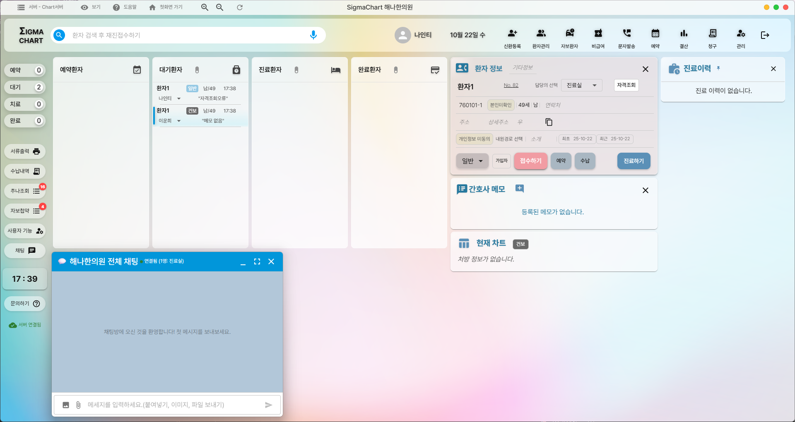
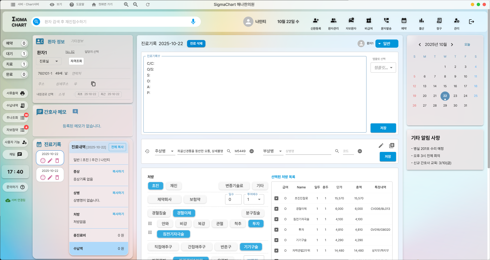
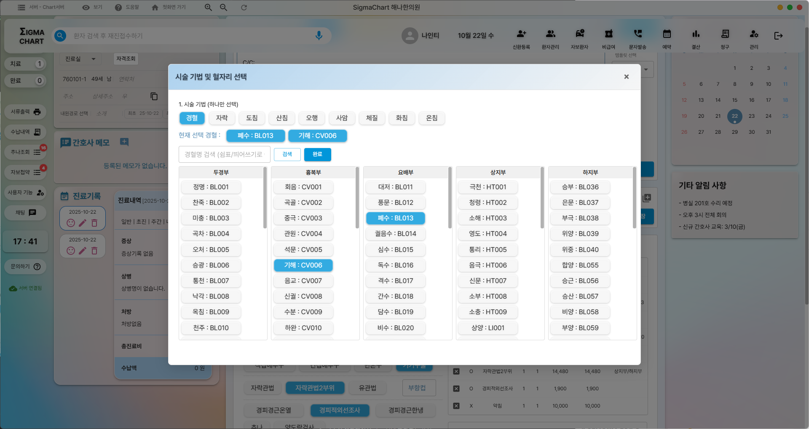
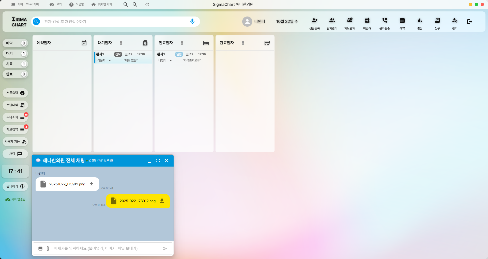

# 시그마차트 원본 화면과 HaniSOAP UI 참고

확인일: 2026년 10월 9일 KST

상태: 공식 공개 화면 관찰과 HaniSOAP UI 초안. 현재 시그마차트를 직접 실행하거나 최신 설치 버전을 검증한 결과는 아니다.

시그마차트 공식 홈페이지의 공개 이미지 4장을 원본 그대로 보관했다. 화면 배치와 명칭, 선택 순서를 확인해 HaniSOAP 진료실·아이패드 화면을 구체화하는 참고 자료다. 스크린샷의 권리는 원저작권자에게 있으며 HaniSOAP 앱에 포함할 디자인 자산으로 사용하지 않는다.

## 1 자료 출처와 확인 범위

- [시그마차트 공식 홈페이지](https://www.sigmachart.co.kr/)
- [공식 홈페이지의 소개 화면](https://iframe.sigmachart.co.kr/): 홈페이지가 삽입한 공개 화면. 아래 이미지 4장의 출처.
- [공식 진료기록부 차팅 안내](https://www.sigmachart.co.kr/3734/), [연결된 안내 영상](https://www.youtube.com/watch?v=Mzo0FTN6xe8)
- [공식 간단요약](https://www.sigmachart.co.kr/3699/), [연결된 설명 영상](https://www.youtube.com/watch?v=7yVQoy99iEg)

이 정리는 PNG 4장을 직접 열어 관찰한 내용이다. 영상은 공식 페이지의 연결을 확인했으며 전체 재생·장면별 검증까지 마친 자료로 취급하지 않는다. 원본 파일명과 화면에는 2025년 10월 22일 표기가 있으므로 확인일과 화면의 표시 날짜를 구분한다.

연화가 작성한 [한방 시술 차팅 목록](../한방_시술_차팅_목록.md)은 별도로 제공된 시그마차트 화면 5장에 근거한다. 그 5장 자체는 현재 저장소와 확인한 최근 로컬 자료에서 찾지 못했다. 이번에 찾은 공식 공개 이미지가 그 5장과 동일하다는 판단은 하지 않는다. 투자 혈자리 쌍·추나 선택 상세 등은 아래 4장으로 새롭게 검증한 내용이 아니다.

## 2 원본 이미지 목록

| 번호 | 화면 | 원본 파일 | 관찰 목적 |
| --- | --- | --- | --- |
| 1 | 환자 현황과 선택 환자 정보 | `images/01-patient-board.png` | 오늘 환자 상태와 선택 환자의 정보 배치 |
| 2 | 진료기록 작성과 시술 선택 | `images/02-consultation-workspace.png` | 환자 정보·과거 이력·현재 기록·처방의 관계 |
| 3 | 시술 기법 및 혈자리 선택창 | `images/03-procedure-acupoint-dialog.png` | 기법·선택 혈자리·부위별 검색과 선택 |
| 4 | 환자 현황과 내부 채팅 | `images/04-patient-board-chat.png` | 상태별 현황판과 보조 창 배치 |

원본 URL, 원래 파일명, 파일 크기, 이미지 크기, SHA-256은 [source manifest](source-manifest.json)에 기록했다. 수집 과정에서 이미지의 글자·색·구성은 수정하지 않았다.

## 3 환자 현황판에서 확인한 구성

상단에 환자 검색과 주요 기능 도구가 있고, 왼쪽 세로 메뉴에 예약·대기·치료·완료의 수가 표시된다. 작업 공간은 예약환자·대기환자·진료환자·완료환자 열로 나뉜다. 선택한 환자의 정보·메모·현재 차트와 진료 이력을 별도 영역에서 함께 보여준다.

HaniSOAP에서는 오늘 현황과 환자 한 명의 진료 작업을 별도 화면으로 두되 환자 선택·상태 표시를 일관되게 유지한다. 연락 필요는 환자의 진료 단계와 독립된 후속 관리 상태로 표시한다.

## 4 진료기록 화면에서 확인한 구성

| 영역 | 화면에서 관찰한 내용 |
| --- | --- |
| 상단 | 환자 검색, 날짜, 주요 기능 도구 |
| 왼쪽 | 선택 환자 정보, 메모, 날짜별 진료기록, 이전 증상·상병·처방과 복사 동작 |
| 중앙 위 | 진료기록 편집 영역. C/C, O/S, S, O, A, P와 템플릿·저장 |
| 중앙 아래 | 상병 입력과 처방·시술 선택. 선택한 처방 목록을 옆에서 함께 표시 |
| 오른쪽 | 달력과 알림 |

기존 대화에서 제안한 오른쪽 AI 보조 영역은 HaniSOAP의 확장 제안이다. 시그마차트 원본 오른쪽이 AI 근거 패널이라는 뜻은 아니다.

화면은 파스텔 배경, 밝은 반투명 패널, 둥근 선택 버튼과 푸른 선택 상태를 사용한다. 패널을 실제로 이동·크기 변경할 수 있는지는 정적 이미지만으로 확정하지 않는다.

## 5 시술 기법과 혈자리 선택에서 확인한 구성

선택창 위에는 시술 기법을 하나 선택하는 영역이 있다. 그 아래에는 현재 선택 혈자리, 혈명 검색과 완료 동작이 있고, 본문에는 두경부·흉복부·요배부·상지부·하지부의 다섯 목록을 나란히 둔다. 목록의 혈자리에는 한글 혈명과 코드가 함께 표시되고 선택한 항목은 색으로 구분된다.

이 화면에서 재사용할 UX 원칙은 기법과 혈자리의 분리, 현재 선택 목록의 지속 표시, 부위별 좁히기, 한글 명칭과 코드의 병기다. HaniSOAP의 환자 기준 좌우 선택과 인체 확대·펜 입력은 별도로 추가하는 기능이다.

## 6 보조 창과 현황판

환자 상태 열과 별도로 내부 채팅 창을 보여준다. HaniSOAP 초기 범위에는 내부 직원 채팅을 넣지 않고, 필요한 방문 상태·아이패드 연결·처리 진행을 같은 위치에서 확인할 수 있게 하는 참고로 사용한다.

## 7 HaniSOAP PC 배치 결정과 화면 초안

2026년 10월 9일 사용자가 제공한 공식 차팅 안내 영상 0:16 캡처를 기준으로 오늘 진료 PC의 주요 영역 배치를 확정했다. 왼쪽 환자 정보·이력, 중앙 SOAP·시술, 오른쪽 재진 브리핑·통증 NRS 요약·확인 항목과 상단 녹음·업로드를 유지한다. 원본 오른쪽의 달력·알림을 재진 지원 정보로 바꾸는 방향도 사용자가 승인했다. 항목별 큰 그래프는 별도 경과 화면에서 연다. 오늘 현황·아이패드의 세부 배치와 각 영역의 크기·상호작용은 계속 구체화한다.

| HaniSOAP 화면 | 기본 배치와 결정 상태 |
| --- | --- |
| 오늘 현황 | 환자 검색과 대기·진료 중·완료 목록. 연락 필요 목록은 별도 구분 |
| 오늘 진료 상단 | 선택 환자·방문, 마이크 선택, 녹음 시작·종료, 별도 파일 업로드, 저장·처리 상태 |
| 오늘 진료 왼쪽 | 환자 정보, 날짜별 진료 이력, 이전 승인 SOAP·처방·안내 |
| 오늘 진료 중앙 위 | 오늘 SOAP 초안·편집·검토·승인. 필요 시 전사 원문 대조 |
| 오늘 진료 중앙 아래 | 오늘 시술과 아이패드 체크 결과. 시술·기법·부위·혈자리·좌우를 구분 |
| 오늘 진료 오른쪽 | 재진 브리핑, 통증 NRS 요약, 오늘 확인할 것, 지난 환자 응답, 경과 보기 버튼. SOAP 근거 선택 시 원문 대조 동작을 연결 |
| 별도 경과 화면 | 통증·증상·활동별 큰 독립 그래프와 선택한 방문의 상세 답변·변화·근거. 환자와 함께 보기 |
| 아이패드 | 상단에 같은 환자·PC 녹음 상태. 현재 시술의 부위 표시만 보여주고 체크 표시 영역의 혈자리 후보를 팝업에서 선택. 화면 전체 필기와 추출 텍스트를 함께 저장 |
| 고객 케어 | 확정: 상단 연락 필요·안내 발송 검토·복약 관리, 왼쪽 환자 목록·중앙 안내와 응답 이력·오른쪽 안내 승인과 연락 완료 처리 |

PC는 익숙한 기록 중심 배치를 유지하고 아이패드는 같은 용어·선택 상태를 사용한다. PC의 다섯 부위 목록을 아이패드에 그대로 줄여 넣지 않고 인체 위의 체크 표시를 앱 내부에서 패턴 인식해 해당 부위 후보 팝업만 연다. 동그라미는 선택 명령으로 인식하지 않고 일반 메모로 보존한다. 침·약침 등 시술을 전환하면 이전 시술의 표시를 숨기고 해당 시술로 돌아오면 선택을 복원한다. 기본 흐름에 부위 선택·메모 모드 전환을 요구하지 않으며, 애매한 획은 메모로 남긴다.

다음 UI 설계에서는 1. 오늘 현황, 2. 오늘 진료, 3. 전사와 SOAP 대조, 4. 아이패드 시술 기록, 5. 후속 관리의 와이어프레임을 만든다. 확정한 PC 주요 영역을 기준으로 의료진의 기록 순서와 자주 보는 정보, 작은 화면의 가독성을 연화와 확인해 세부 동작을 정한다.
